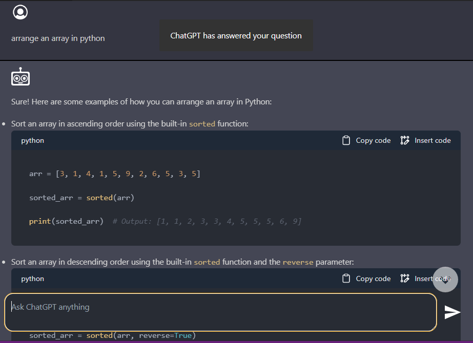

    <h2>Revolutionizing Software Development with Our Cutting-Edge Tools</h2>
    
We're excited to announce that we've recently developed a VS Code extension that we believe will become one of the fastest growing extensions in VS Code.

    

  
  
Join our list of trusting developers. Our carefully crafted toolset is designed to simplify your workflow and make your life easier. Don't miss out on the opportunity to take your productivity to the next level, download our extension now!

  

  <video src="videos/main.mp4" alt="extension usecase video" title="main video" autoplay controls loop></video>
  
So why waste your time searching for tools when you can find everything you need in one place? Download our extension and take your web development skills to the next level.

    
    
Now, users can even access ChatGPT directly within VSCode! With the ChatGPT extension, you can easily ask ChatGPT any questions you may have while coding, without ever leaving your workspace. Simply click on the ChatGPT icon on the activity bar to open a webview and start chatting. Take your coding experience to the next level with ChatGPT!

    

        
        
    

  <h2>🔍 Resources Tools</h2>
  
Free galleries of icons, illustrations, images, and videos that can be used in your web development projects.

  <h3>🎨 Icon Gallery</h3>
  
This tool provides access to a collection of 150,000 free SVG icons. You can easily find the desired icon by searching for it or browsing through categories.

  
  <h3>🖼️ Illustrations Gallery</h3>
  
This tool offers thousands of illustrations and vectors for use in web development projects. The illustrations are available in various formats and can be searched.

  
  <h3>📷 Images Gallery</h3>
  
This tool provides access to millions of stock images for use in web development projects. The images are available in various formats and can be searched and filtered by category.

<h2>🎥 Video Gallery</h2>

This tool offers millions of stock videos for use in web development projects. The videos are available in various formats and can be searched and filtered by category.

<h2>📝 Text Tools</h2>

Various tools to manipulate text, such as converting text case, generating random text, and counting letters.

<ul>
    <li>
        <h3>⬆️ Case Converter</h3>
        
This tool can convert your text or string to uppercase, lowercase, title case, and many more. You can input your text and choose the desired case conversion.

    </li>
    <li>
        <h3>📖 Lorem Ipsum Generator</h3>
        
This tool generates random lorem ipsum text with various options. You can input the desired number of paragraphs, words, or bytes, and choose between different lorem ipsum variants.

    </li>
    <li>
        <h3>🔑 Password Generator</h3>
        
This tool generates strong and secure passwords with various options. You can choose the length, character types, and number of passwords to generate.

    </li>
    <li>
        <h3>📝 Letter Counter</h3>
        
This tool counts the number of letters, words, and sentences in your text. You can input your text and get the results instantly.

    </li>
</ul>
<h2>🎨 CSS Tools</h2>

Various tools to help with CSS development, such as generating CSS flexbox, box shadows, and color palettes.

<ul>
    <li>
        <h3>📏 Flexbox Generator</h3>
        
This tool generates CSS flexbox in an interactive way. You can select the desired flexbox properties and see the changes in real-time.

        
    </li>
    <li>
        <h3>🔲 Box Shadow Generator</h3>
        
This tool generates a box shadow with various options. You can select the desired shadow properties and see the changes in real-time.

    </li>
    <li>
        <h3>🌈 Color Palettes</h3>
        
This tool provides beautiful color palettes for use in web development projects. You can browse through various palettes and copy the color codes for use in your CSS.

        
    </li>
    <li>
        <h3>🎨 CSS Background Gradient Generator</h3>
        
This tool generates CSS background gradients with various options. You can select the desired gradient properties and see the changes in real-time.

    </li>
    <li>
        <h3>👆 CSS Button Generator</h3>
        
This tool generates CSS buttons with various options. You can select the desired button properties and see the changes in real-time.

    </li>
    <li>
        <h3>🌐 SVG Blob Generator</h3>
        
This tool generates SVG blobs that can be used as backgrounds or decorative elements in web development projects. You can customize the blob shape and color and download the SVG file.

    </li>

    🎨 CSS Pattern Generator
    This tool provides a range of different patterns that can be used as backgrounds or decorative elements in web development projects. You can customize the pattern color and download the CSS code.

🤹 Miscellaneous Tools

Various miscellaneous tools that can be helpful in different aspects of web development.

    🍅 Pomodoro Timer
    This tool is a timer that follows the Pomodoro Technique, a time management method that uses a timer to break down work into intervals, usually 25 minutes in length, separated by short breaks. The Pomodoro Timer helps users stay focused and productive by providing a simple and efficient way to manage their work time.

    🌈 Color Converter
    This tool allows users to convert between different color formats, such as hex, hsla, and rgba. The Color Converter is helpful for developers and designers who need to work with various color formats in their projects.

    📱 QR Code Generator
    This tool generates QR codes from text. QR codes are two-dimensional barcodes that can be scanned with a smartphone camera to quickly access information, such as a website or contact information. The QR Code Generator is useful for businesses and individuals who want to create QR codes for marketing or personal use.

    🌳 JSON Formatter
    This tool formats and displays JSON data in a tree-like structure, making it easier to read and understand. The JSON Formatter is helpful for developers who work with JSON data and need a quick and efficient way to view and analyze it.
